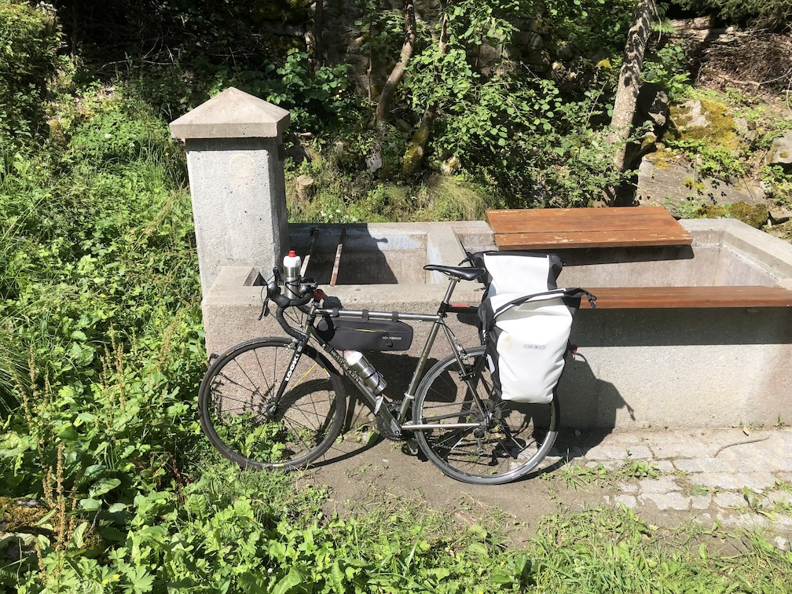
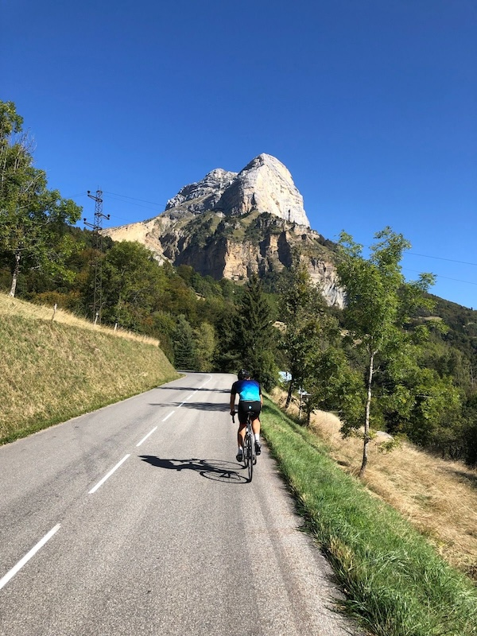

# Strava API :: articles collection

* [Strava Swagger UI](https://developers.strava.com/playground/)
* [Using Python to Explore Strava Activity Data](https://towardsdatascience.com/using-the-strava-api-and-pandas-to-explore-your-activity-data-d94901d9bfde)

